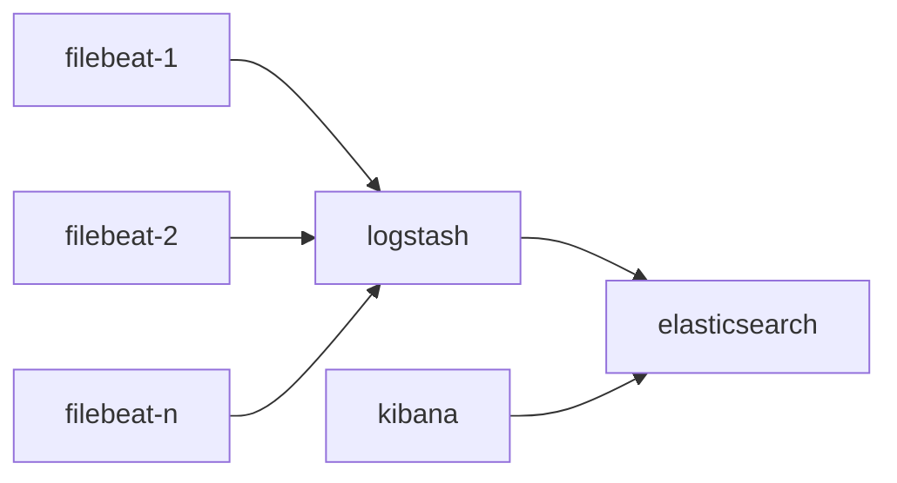

## 001-ELK-filebeat-单机部署-nginx日志分析例子

[toc]

### 1 说明

- 安装环境 redhat 6.7/CentOS7
- java sdk 8（以上）
- 安装在应用用户上 / 需要root用户（调整操作系统参数）

```
elasticsearch-5.6.8.tar.gz          // elasticsearch 5.6.8版本安装包
filebeat-5.6.8-linux-x86_64.tar.gz  
kibana-5.6.8-linux-x86_64.tar.gz
logstash-5.6.8.tar.gz
beats-dashboards-5.6.8.zip          // elastic 提供beat工具默认视图 dashboard模板
ingest-geoip-5.6.8.zip              // elasticsearch geo插件
ingest-user-agent-5.6.8.zip         // elasticsearch geo 依赖 插件


wget https://artifacts.elastic.co/downloads/elasticsearch/elasticsearch-5.6.8.tar.gz
wget https://artifacts.elastic.co/downloads/kibana/kibana-5.6.8-linux-x86_64.tar.gz
wget https://artifacts.elastic.co/downloads/logstash/logstash-5.6.8.tar.gz
wget https://download.elastic.co/elasticsearch/release/org/elasticsearch/distribution/tar/elasticsearch/2.4.6/elasticsearch-2.4.6.tar.gz
wget https://download.elastic.co/kibana/kibana/kibana-4.6.6-linux-x86_64.tar.gz
```

- 工具间关系



- 端口使用说明

端口 | 使用
---|---
8021/8023 | elasticsearch 对外服务端口和集群间通信接口
8025 | kibana 对外服务端口
8027 | logstach 接收filebeat数据端口


### 2 安装过程

- 安装包

```

elk_software.tar.gz （见ftp服务器）

```

#### 2.1 elasticsearch 安装


- 解压版本

```
cd $HOME/elk_software （在$HOME目录解压elk_software.tar.gz）
sh install_elasticsearch.sh
```

- 修改配置

```
cd $HOME/ELK/elasticsearch/elasticsearch-5.6.8/config

# cluster.name: inner_es_cluster
# node.name: inner_es_node_01
bootstrap.memory_lock: false
bootstrap.system_call_filter: false
network.host: 0.0.0.0
http.port : 8021
transport.tcp.port : 8023
# discovery.zen.ping.unicast.hosts: ["10.128.13.19:8023"]
# discovery.zen.minimum_master_nodes: 1
# gateway.recover_after_nodes: 1
# path.data: /path/to/data  //如果需要修改数据路径则修改
# path.logs: /path/to/logs  //如果需要修改日志路径则修改
```

- 需要关注的配置

```
config/jvm.options
jvm heap space 默认为1G
```

- 启动

```
cd $HOME/ELK/elasticsearch/elasticsearch-5.6.8/bin
./elasticsearch 

```

- 启动报错问题

```
# 问题3
[1]: max file descriptors [4096] for elasticsearch process is too low, increase to at least [65536]
    vim /etc/security/limits.conf
    添加如下内容:
    * soft nofile 65536
    * hard nofile 131072
    * soft nproc 2048
    * hard nproc 4096
    noproc - 进程的最大数目
    nofile - 打开文件的最大数目

[3]: max virtual memory areas vm.max_map_count [65530] is too low, increase to at least [262144]

    vim /etc/sysctl.conf
    添加下面配置：
    vm.max_map_count=655360
    并执行命令：
    #sysctl -p
    然后，再启动elasticsearch，即可启动成功。
    限制一个进程可以拥有的VMA(虚拟内存区域)的数量
    
[4] max number of threads [1024] for user [elk] is too low, increase to at least [2048]
vi /etc/security/limits.d/90-nproc.conf 
修改如下内容：
* soft nproc 1024
#修改为
* soft nproc 2048    

```

- 启动验证

```
netstat -an | grep 802*
curl 'http://localhost:8021/?pretty'

    {
      "name" : "d7WkMNV",
      "cluster_name" : "elasticsearch",
      "cluster_uuid" : "URMWEVCDR26592H2y49hWw",
      "version" : {
        "number" : "5.6.8",
        "build_hash" : "688ecce",
        "build_date" : "2018-02-16T16:46:30.010Z",
        "build_snapshot" : false,
        "lucene_version" : "6.6.1"
      },
      "tagline" : "You Know, for Search"
    }
```

- 停止 elasticsearch 服务安装插件

```
bin/elasticsearch-plugin install file:///home/ap/elk/elk_software/ingest-geoip-5.6.8.zip
bin/elasticsearch-plugin install file:///home/ap/elk/elk_software/ingest-user-agent-5.6.8.zip
bin/elasticsearch-plugin list 
```

- 后台启动elasticsearch

```
nohup ./elasticsearch &
```


#### 2.2 logstash 安装

- 解压版本

```
cd $HOME/elk_software （在$HOME目录解压elk_software.tar.gz）
sh install_logstash.sh
```

#### 2.3 kibana 安装

- 解压版本

```
cd $HOME/elk_software （在$HOME目录解压elk_software.tar.gz）
sh install_kibana.sh
```

- 修改配置

```
cd ELK/kibana/kibana-5.6.8-linux-x86_64/config/kibana.yml

vi kibana.yml 
修改如下参数的配置

server.port: 8025
server.host: "0.0.0.0"
elasticsearch.url: "http://localhost:8021" // localhost 改成elasticsearch安装服务器的ip
```

- 启动服务

```
cd ELK/kibana/kibana-5.6.8-linux-x86_64/bin
./kibana

```

- 服务验证

```
curl localhost:8025
```

- 后台运行服务


#### 2.4 filebeat安装
 
- 版本解压
 
```
cd $HOME/elk_software （在$HOME目录解压elk_software.tar.gz）
sh install_filebeat.sh
```

- 配置

```
grep -Evn "^$|#" filebeat.yml

12:filebeat.prospectors:
18:- input_type: log
21:  paths:
22:    - /home/ap/elk/elk_software/*.log   //这里修改为nginx服务器nginx日志目录
24:  
64:name: "ap1"  // 可修改为服务器名
68:tags: ["nginx"]
91:output.logstash:
93:  hosts: ["localhost:8027"] //localhost 修改为logstach安装服务器

```

- 启动

```
./filebeat -configtest -e filebeat.yml // 配置验证 配置无误返回 OK

- 启动
nohup ./filebeat -c filebeat.yml &
```


#### 2.5 启动logstach

- 新建配置

```

input {
  beats {
	port => "8027"
  }
}
filter {
  grok {
    match => { "message" => "%{IP:remote_addr}\s-\s%{USER:remote_user}\s\[%{HTTPDATE:time_local}\]\s\"%{WORD:method}\s%{URIPATHPARAM:request}\s%{DATA:httpversion}\"\s%{NUMBER:status:int}\s%{NUMBER:body_bytes_sent:int}\s\"%{DATA:http_referer}\"\s%{QUOTEDSTRING:http_user_agent}\s\"%{IP:http_x_forwarded_for}\"" }
  }
  date{
    match => ["time_local", "dd/MMM/yyyy:HH:mm:ss Z"]
    target => "@timestamp"      
  }  
  geoip{
    source =>'http_x_forwarded_for'
    target => "geoip"
    add_field => [ "[geoip][coordinates]", "%{[geoip][longitude]}" ]
    add_field => [ "[geoip][coordinates]", "%{[geoip][latitude]}"  ]
  }
  mutate {
    convert => [ "[geoip][coordinates]", "float"]
  }
}
output {
  elasticsearch {
    hosts => [ "localhost:8021" ]
    manage_template => true
    index => "logstash-nginx-access%{+yyyy.MM.dd}"
  }
}

- 配置解释:
input - 为filebeat 开放8027端口 获取filebeat日志数据
filter - 
    grok - 日志的正则解析
    date - 将nginx日志中的time_local(实际实际时间)-映射到@timestamp变量中，目的使时间统计更准确
    geoip - ip到地理位置信息映射
output - 数据输出到elasticsearch数据库中
    hosts - 根据实际服务器修改
    index - 数据按日期建立index，后续需按日期提供进行清理策略
    
```

- 验证配置正确性

```
./logstash -f rac.conf --config.test_and_exit
```

- 启动

```
./logstash -f rac1.conf
```

#### 2.6 kibana 界面展示配置

- 配置index patterns

登录kibana web

management-index patterns- create index pattern

```

index patter：logstash-*
time flter filed name： @timestamp
expand index pattern when searching （勾选）

```

- discover 查询
- visualize 配置
- databoard 配置
略


#### 查询数据已经清理

```
curl -X GET "localhost:8021/_cat/indices?v"
curl -XDELETE 'http://localhost:8021/logstash*'
```

